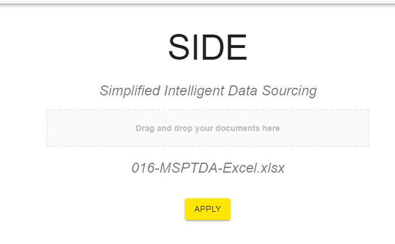
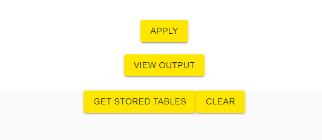
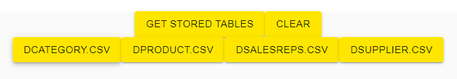
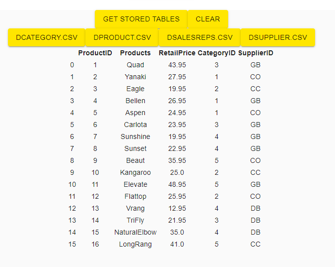

# H4-Simplified-Data-sourcing-FA-BASH
PS - Simplified-Data-sourcing-FA \
Team - BASH \
Technical Panel - Sheril Kandothankandy; Anandhageethan Venkatesan \
Business Judges - Raghavendra A Deshpande; Vasudeva H Nagarajarao \
Mentor - Gaurav Kumar Agarwal 

## Steps to run SIDE locally

### Frontend (React):
1. cd Side
2. npm install
3. npm start

### Backend (Python Flask):
1. cd SIDE-backend
2. pip install -r requirements.txt
3. python side.py

### SIDEBAR: Azure API (Jupyter Notebook):
1. Something
2. Something

### D-Tale
1. 
2.

## Usage
- Upload (or drag + drop) a file and click on 'Apply'

*File Types Accepted: PDF, XLSX, Demo File: 016-MSPTDA-Excel.xlsx* 

- Click on 'View Output' to see a raw list of extracted tables (meta-data)

- Click on 'Get Stored Tables' to view table data extracted and stored. It will render a list of clickable tables rendered.

- Click on any extracted table to view table data extracted. Select columns/rows as required.

- Click on 'Clear' to hide the table data view

